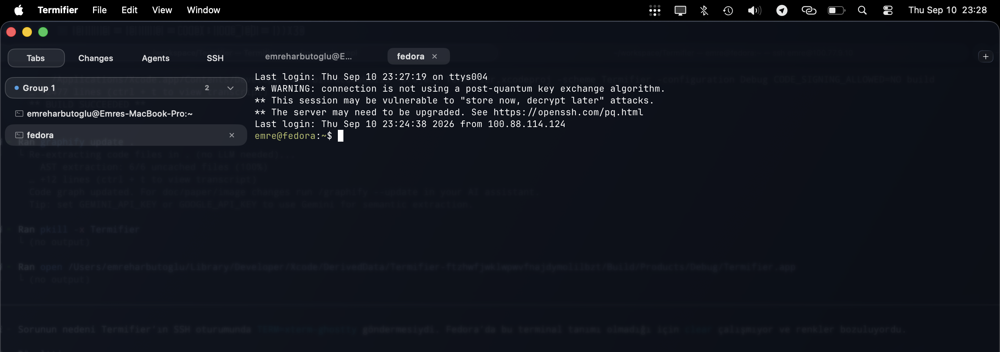

# Termifier

Termifier is a native macOS terminal for running and supervising multiple coding agents without leaving the terminal workflow.

## Fork notice

Termifier is a fork of [Yuuichi Eguchi's Calyx](https://github.com/yuuichieguchi/Calyx). This fork renames the application and its supporting tools to Termifier, uses a new app icon, and removes the built-in Sparkle updater.

## Highlights

- Native AppKit and SwiftUI interface powered by libghostty
- Tabs, split panes, tab groups, persistent sessions, and remote sessions
- Agent status tracking and a shared approval inbox
- Git changes, commit history, and inline diff review
- MCP tools for terminal control, agent communication, command history, and LSP features
- Scriptable browser tabs and a bundled `termifier` CLI

## Features added in this fork

In addition to the Termifier rebrand, this fork includes:

- A custom Termifier app icon and removal of the Sparkle updater.
- An SSH sidebar next to Tabs, Changes, and Agents for saved server profiles.
- Password authentication stored in the macOS Keychain, with connection metadata kept locally.
- Identity-file authentication for `.pem` and other SSH keys, including a file picker.
- Editable SSH profiles with password preservation when the password field is left blank.
- One-click connection opening in a new terminal tab with a standard `xterm-256color` environment for Linux compatibility.

### SSH sessions

Click **SSH** in the sidebar to add or edit a connection. Choose Password or Identity File authentication, then click a saved profile to open it as a terminal tab automatically.



## Requirements

- macOS 26 Tahoe or later
- Xcode 26 or later
- [Zig](https://ziglang.org/)
- [XcodeGen](https://github.com/yonaskolb/XcodeGen)

## Build from source

Clone the repository with its submodules:

```bash
git clone --recursive https://github.com/emre-h/Termifier.git
cd Termifier
```

Build the Ghostty framework:

```bash
cd ghostty
zig build -Demit-xcframework=true -Dxcframework-target=native
cd ..
cp -R ghostty/macos/GhosttyKit.xcframework .
```

Generate the Xcode project and build Termifier:

```bash
xcodegen generate
xcodebuild -project Termifier.xcodeproj -scheme Termifier -configuration Debug build
```

The generated Xcode project is intentionally ignored; `project.yml` is the source of truth.

## License

Termifier is available under the [MIT License](LICENSE). It includes and builds on [Ghostty](https://github.com/ghostty-org/ghostty), also licensed under the MIT License.
